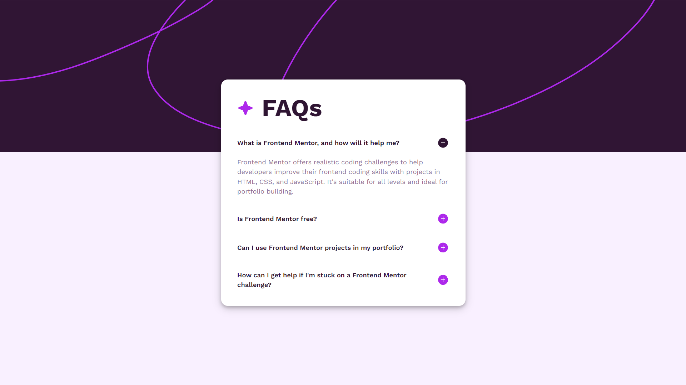

# Frontend Mentor - FAQ accordion solution

This is a solution to the [FAQ accordion challenge on Frontend Mentor](https://www.frontendmentor.io/challenges/faq-accordion-wyfFdeBwBz).   

## Table of contents

- [Overview](#overview)
  - [The challenge](#the-challenge)
  - [Screenshot](#screenshot)
  - [Links](#links)
- [My process](#my-process)
  - [Built with](#built-with)
  - [What I learned](#what-i-learned)
  - [Useful resources](#useful-resources)
- [Author](#author)

## Overview

### The challenge

Users should be able to:

- Hide/Show the answer to a question when the question is clicked
- Navigate the questions and hide/show answers using keyboard navigation alone
- View the optimal layout for the interface depending on their device's screen size
- See hover and focus states for all interactive elements on the page

### Screenshot

### Links

- Solution URL: [Frontend Mentor Solution](https://www.frontendmentor.io/solutions/basic-solution-using-css-flexbox-c0IpEoMpgD)
- Live Site URL: [Live Site](https://deepanshu-kaushik.github.io/faq-accordion-main/)

## My process

### Built with

- Semantic HTML5 markup
- CSS custom properties
- Flexbox
- Mobile-first workflow
- [Tailwind CSS](https://tailwindcss.com/) - CSS Framework

### What I learned

In this project, I honed my skills in web development by focusing on the fundamentals of HTML and CSS, with a particular emphasis on mastering Flexbox. Through the implementation of Flexbox, I gained a deeper understanding of creating responsive and visually appealing designs.

I incorporated Tailwind CSS into this project, and it played a significant role in enhancing my familiarity with the framework, as well as reinforcing my grasp of fundamental concepts in vanilla CSS.

### Useful resources

- [Tailwind CSS Documentation](https://tailwindcss.com/docs/installation) - The documentation greatly assisted me in understanding the framework. I referred to it whenever I encountered difficulties.

## Author

- Linkedin - [Deepanshu Kaushik](https://www.linkedin.com/in/hello-deepanshu/)
- Frontend Mentor - [@Deepanshu-Kaushik](https://www.frontendmentor.io/profile/Deepanshu-Kaushik)
- LeetCode - [@DeepanshuKaushik](https://leetcode.com/DeepanshuKaushik/)